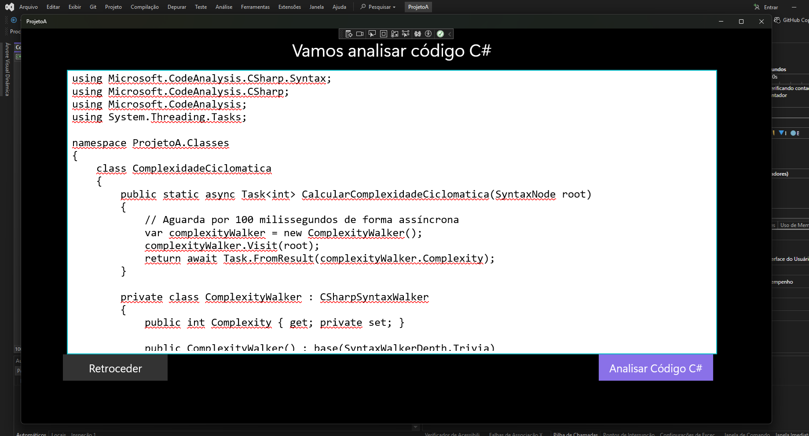

# Final Course Project – Vulnerability Analyzer in C# (.NET UWP)




## Description

This project is a desktop application for Windows developed in C# (.NET UWP) aimed at **analyzing known vulnerabilities in C# code**. The application identifies potentially insecure code patterns, helping developers improve the security of their applications.

---

## Features

* Automatic scanning of files and folders containing C# code.
* Detection of known vulnerabilities (e.g., SQL Injection, XSS, use of obsolete or insecure methods).
* Generation of detailed reports about the issues found.
* Intuitive and user-friendly graphical interface based on UWP.

---

## Requirements

* Windows 10 or higher with Developer Mode enabled
* .NET 6+ Runtime
* Visual Studio 2022 (or higher) to compile the source code
* UWP installed
* Read permissions for the directories to be analyzed

---

## Installation

1. Clone the repository:

```bash
git clone [https://github.com/seu-usuario/projeto-final-csharp.git](https://github.com/miguelPRG/ProjetoFinalCurso)
```

2. Open the `.sln` solution in Visual Studio.

3. Build and run the application.

---

## Usage

1. Run the application.
2. Select the folder or C# file you want to analyze.
3. Click "Analyze".
4. Check the generated report for details about the vulnerabilities found.

---

## Technologies Used

* C#
* .NET (UWP)
* Visual Studio

---

## Contribution

Contributions are welcome! To suggest improvements or report bugs, open an *issue* or submit a *pull request*.

---

## License

This project is licensed under the [MIT License](LICENSE).
